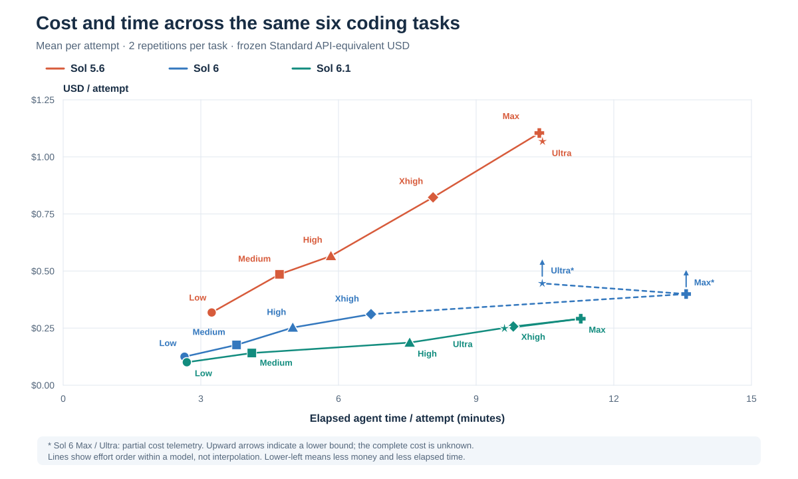

# Sol Coding Benchmark

[](https://github.com/Tor-Production/sol-coding-benchmark/actions/workflows/verify.yml)

**A reproducible comparison of Sol 5.6, Sol 6, and Sol 6.1 across six programming tasks and six reasoning efforts.**

This benchmark measures what it costs, how long it takes, and how well the submitted code works. It includes the executable stand, task contracts, evaluators, all **216 attempt records**, submitted implementations, and an English report.

| Models | Reasoning efforts | Tasks | Repetitions | Attempts |
| :--- | :--- | ---: | ---: | ---: |
| Sol 5.6 · Sol 6 · Sol 6.1 | Low · Medium · High · Xhigh · Max · Ultra | 6 | 2 per task and configuration | **216** |

## Read the results

**Sol 6.1 Low was the cheapest configuration with 12/12 accepted deliveries:** about **$0.101 per attempt** and **162 seconds per attempt**. Costs use a frozen Standard API-equivalent token schedule, rather than a subscription invoice.



Across the full comparison, **214 attempts completed** and **213 completed with main acceptance**. A provider capacity failure, a timed-out delivery, and an optimizer scale failure remain in the dataset. Expanded checks also found two cache defects that the original acceptance tests missed.

Functional scores are close to the ceiling. These results support comparisons of cost, speed, task behavior, and candidate-written tests on this suite; they do not establish a general intelligence ranking. See the [results and all 18 configurations](docs/results.md) and [interpretation limits](docs/limitations.md).

**Start here:** [15-page PDF report](artifacts/Sol_Benchmark_Consolidated_EN.pdf) · [Results](docs/results.md) · [Methodology](docs/methodology.md) · [Run the stand](docs/reproduction.md)

## What the tasks test

| Task | Workload | Main challenge |
| :--- | :--- | :--- |
| [01 · Interval union](tasks/01-easy/TASK.md) | Small algorithm | Validation, adjacency, purity, and efficient interval merging |
| [02 · TTL/LRU cache](tasks/02-medium/TASK.md) | Stateful component | Expiry, eviction, injected time, and consistent edge cases |
| [03 · Dependency graph](tasks/03-hard/TASK.md) | Concurrent algorithm | Dependencies, execution order, failures, and bounded concurrency |
| [04 · Reservation service](tasks/04-components/TASK.md) | Multiple components | SQLite transactions, HTTP behavior, a CLI, and idempotency |
| [05 · Exact portfolio optimizer](tasks/05-optimizer/TASK.md) | Constrained optimization | Dependencies, conflicts, several budgets, signed values, and exact tie-breaking |
| [06 · Serializable MVCC store](tasks/06-transactions/TASK.md) | Transaction engine | Snapshots, serializability, range phantoms, savepoints, checkpoints, and recovery |

The two larger tasks use independent oracles, adversarial cases, and interaction traces. [Task guide](docs/tasks.md) explains the contracts and evaluator coverage.

## Verify the published evidence

Cloning and inspecting this repository does not require model access. Verification uses Python's standard library:

```sh
git clone https://github.com/Tor-Production/sol-coding-benchmark.git
cd sol-coding-benchmark
python scripts/verify_archive.py
```

The verifier checks all 216 cells, every candidate file, recorded token costs, aggregate results, quality-evaluation bindings, and the report's SHA-256. The [provenance notes](docs/provenance.md) distinguish original source hashes from sanitized public-export hashes.

To run offline stand checks or start a fresh experiment, follow [reproduction](docs/reproduction.md). Measured execution is gated explicitly and requires an authenticated Codex installation with access to the exact requested models. Availability can change; the stand checks the model catalog and refuses substitutions. A fresh run writes local outputs separately from the published archive.

## Quality is more than a passing score

- **Functional behavior:** original acceptance tests, plus category-weighted checks for the two larger tasks.
- **Expanded correctness:** additional boundary and property tests for the original four tasks.
- **Candidate-written tests:** sensitivity to fixed task-specific defects, with unavailable coverage shown explicitly.
- **Runtime and memory:** measured separately for the original four task implementations.
- **Design review:** a documented rubric, still pending; no complete manual quality score is claimed.

Read [scoring](docs/scoring.md) before comparing these criteria. They measure different things and have different coverage.

## Repository map

| Path | Contents |
| :--- | :--- |
| [`docs/`](docs/methodology.md) | Methodology, tasks, scoring, reproduction, limitations, and provenance |
| [`tasks/`](tasks/) | Exact task contracts, starter files, and supplied tests |
| [`harness/`](harness/) · [`evaluator/`](evaluator/) | Scheduling, native protocol, telemetry, grading, controls, and qualification |
| [`quality-v2.1/`](quality-v2.1/) | Expanded checks and quality evaluation for the original four tasks |
| [`results/`](results/) | Structured results, per-attempt evidence, hashes, and scoring records |
| [`candidates/`](candidates/) | All 216 captured candidate snapshots, including unsuccessful attempts |
| [`artifacts/`](artifacts/) · [`assets/`](assets/) | Consolidated PDF and data-derived figures |

Published metadata removes local account balances, session identifiers, and machine-specific paths. Candidate files and the PDF retain their original bytes. Raw authentication files and RPC/session logs are excluded.

Maintained by [Tor Production](https://github.com/Tor-Production). This is an independent benchmark, unaffiliated with OpenAI.
