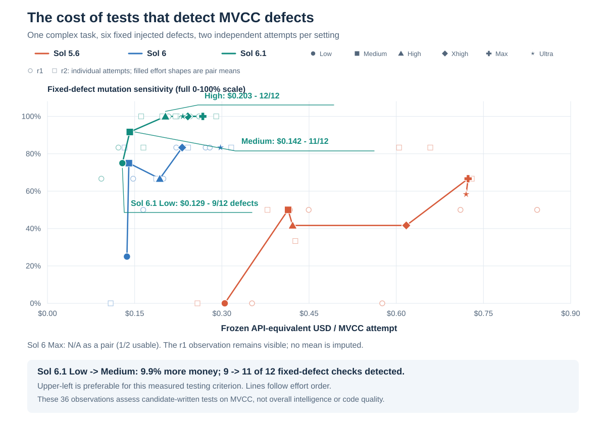

# Sol Coding Benchmark

[](https://github.com/Tor-Production/sol-coding-benchmark/actions/workflows/verify.yml)

**A reproducible comparison of Sol 5.6, Sol 6, and Sol 6.1 across six programming tasks and six reasoning efforts.**

This benchmark examines **what extra reasoning buys in generated code and tests, and what it costs in dollars**. It includes the executable stand, task contracts, evaluators, all **216 attempt records**, submitted implementations, and an English report.

| Models | Reasoning efforts | Tasks | Repetitions | Attempts |
| :--- | :--- | ---: | ---: | ---: |
| Sol 5.6 · Sol 6 · Sol 6.1 | Low · Medium · High · Xhigh · Max · Ultra | 6 | 2 per task and configuration | **216** |

## What extra reasoning buys

**About 10% more spending from Sol 6.1 Low to Medium improved MVCC defect detection from 9/12 to 11/12 across the two attempts.** Mean task cost rose from about **$0.129 to $0.142**. High detected all six fixed defects in both attempts at about **$0.203**. These are task-specific test results, measured against the same declared defect set.



**Read the chart:** farther left costs less; higher detects more of these six defects. Faint points retain the individual repetitions; connected effort means require two usable evaluations. N/A stays unavailable. Dollar estimates use frozen Standard API token rates, rather than a subscription invoice.

The [six findings](docs/findings.md) connect cost to concrete evidence:

- **Test value:** MVCC defect detection differs even though every implementation passed the main checks.
- **Bugs anticipated:** a per-attempt matrix shows which transactional defects the generated tests caught.
- **Code performance:** Sol 6.1 Ultra's DAG code had 32.3% lower execution time than Low's on the fixed workload, at 2.11× generation cost.
- **Effort premium:** Sol 6.1 Max cost 2.90× Low across the suite, with the same main functional score and accepted count.
- **Repeatability:** 105 of 106 exact-cost repetition pairs had identical main grades; 20 pairs differed by more than 1.5× in cost.
- **Price versus usage:** a matched Sol 6/Sol 6.1 bridge separates frozen tariff repricing from the remaining observed usage difference.

For context, **16 of 18 settings reached a 100/100 main functional score** and **213 of 216 attempts were accepted deliveries**. Sol 6.1 Low was the cheapest fully observed setting at 100/100 with 12/12 acceptance: about **$0.101 per attempt**. The findings measure different aspects of these tasks; they do not create an overall code-quality or intelligence ranking. [All settings and supplementary charts](docs/results.md) retain the full comparison.

**Start here:** [Six findings](docs/findings.md) · [English PDF report](artifacts/Sol_Benchmark_Consolidated_EN.pdf) · [All results](docs/results.md) · [Methodology](docs/methodology.md) · [Run the stand](docs/reproduction.md)

## What the tasks test

| Task | Workload | Main challenge |
| :--- | :--- | :--- |
| [01 · Interval union](tasks/01-easy/TASK.md) | Small algorithm | Validation, adjacency, purity, and efficient interval merging |
| [02 · TTL/LRU cache](tasks/02-medium/TASK.md) | Stateful component | Expiry, eviction, injected time, and consistent edge cases |
| [03 · Dependency graph](tasks/03-hard/TASK.md) | Concurrent algorithm | Dependencies, execution order, failures, and bounded concurrency |
| [04 · Reservation service](tasks/04-components/TASK.md) | Multiple components | SQLite transactions, HTTP behavior, a CLI, and idempotency |
| [05 · Exact portfolio optimizer](tasks/05-optimizer/TASK.md) | Constrained optimization | Dependencies, conflicts, several budgets, signed values, and exact tie-breaking |
| [06 · Serializable MVCC store](tasks/06-transactions/TASK.md) | Transaction engine | Snapshots, serializability, range phantoms, savepoints, checkpoints, and recovery |

The two larger tasks use independent oracles, adversarial cases, and interaction traces. [Task guide](docs/tasks.md) explains the contracts and evaluator coverage.

## Verify the published evidence

Cloning and inspecting this repository does not require model access. Verification uses Python's standard library:

```sh
git clone https://github.com/Tor-Production/sol-coding-benchmark.git
cd sol-coding-benchmark
python scripts/verify_archive.py
```

The verifier checks all 216 cells, every candidate file, recorded token costs, aggregate results, quality-evaluation bindings, and the report's SHA-256. The [provenance notes](docs/provenance.md) distinguish original source hashes from sanitized public-export hashes.

To run offline stand checks or start a fresh experiment, follow [reproduction](docs/reproduction.md). Measured execution is gated explicitly and requires an authenticated Codex installation with access to the exact requested models. Availability can change; the stand checks the model catalog and refuses substitutions. A fresh run writes local outputs separately from the published archive.

## Quality is more than a passing score

- **Functional behavior:** six-task macro score from original acceptance tests and category-weighted checks for the two larger tasks.
- **Expanded correctness:** additional boundary and property tests for the original four tasks.
- **Candidate-written tests, the lead chart's Y-axis:** sensitivity to six fixed MVCC defects, with unavailable coverage shown explicitly; other tasks retain their own defect sets.
- **Runtime and memory:** measured separately for the original four task implementations.
- **Design review:** a documented rubric, still pending; no complete manual quality score is claimed.

Read [scoring](docs/scoring.md) before comparing these criteria. They measure different things and have different coverage.

## Repository map

| Path | Contents |
| :--- | :--- |
| [`docs/`](docs/findings.md) | Six findings, methodology, tasks, scoring, reproduction, limitations, and provenance |
| [`tasks/`](tasks/) | Exact task contracts, starter files, and supplied tests |
| [`harness/`](harness/) · [`evaluator/`](evaluator/) | Scheduling, native protocol, telemetry, grading, controls, and qualification |
| [`quality-v2.1/`](quality-v2.1/) | Expanded checks and quality evaluation for the original four tasks |
| [`results/`](results/) | Structured results, per-attempt evidence, hashes, and scoring records |
| [`candidates/`](candidates/) | All 216 captured candidate snapshots, including unsuccessful attempts |
| [`artifacts/`](artifacts/) · [`assets/`](assets/) | Consolidated PDF and data-derived figures |

Published metadata removes local account balances, session identifiers, and machine-specific paths. Candidate files retain their original bytes. The current PDF and figures were revised on **5 October 2026** to present six evidence-based findings; measurements and grades are unchanged. The [original 4 October PDF](artifacts/archive/Sol_Benchmark_Consolidated_EN_20261004.pdf) and [earlier cost-versus-functional-quality revision](artifacts/archive/Sol_Benchmark_Consolidated_EN_20261005_cost_quality.pdf) are preserved unchanged. Raw authentication files and RPC/session logs are excluded.

Maintained by [Tor Production](https://github.com/Tor-Production). This is an independent benchmark, unaffiliated with OpenAI.
