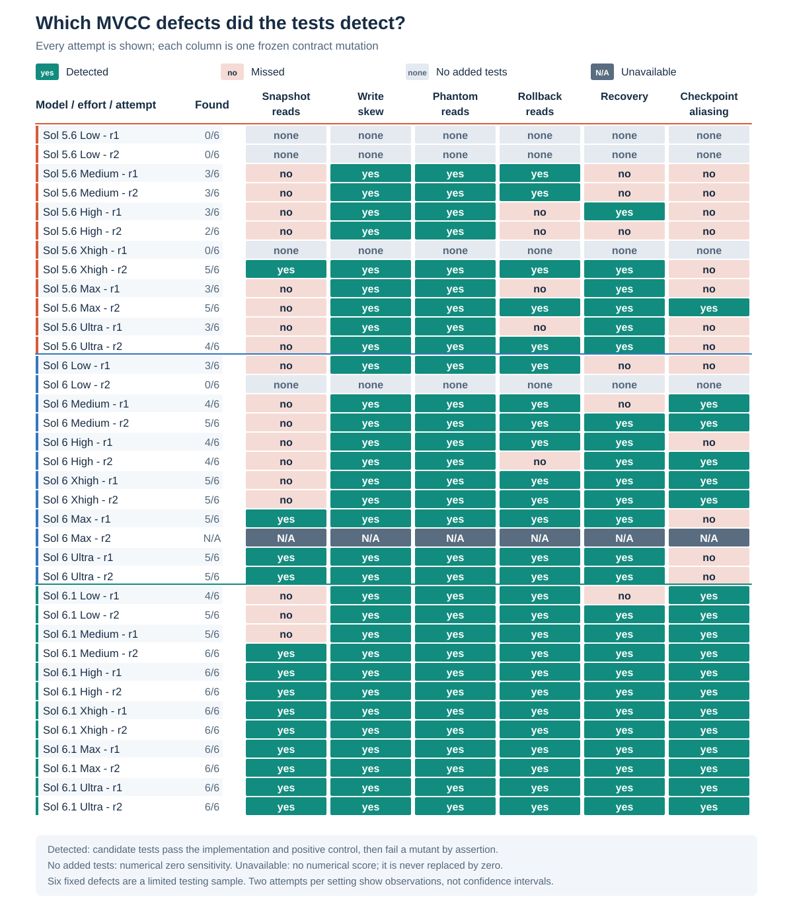
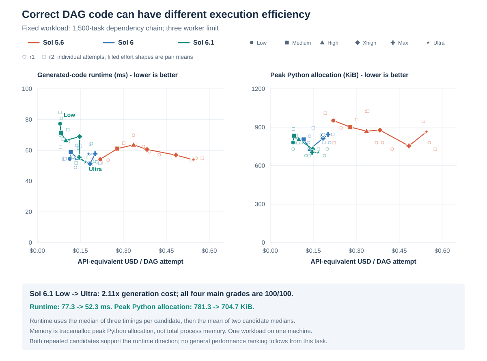
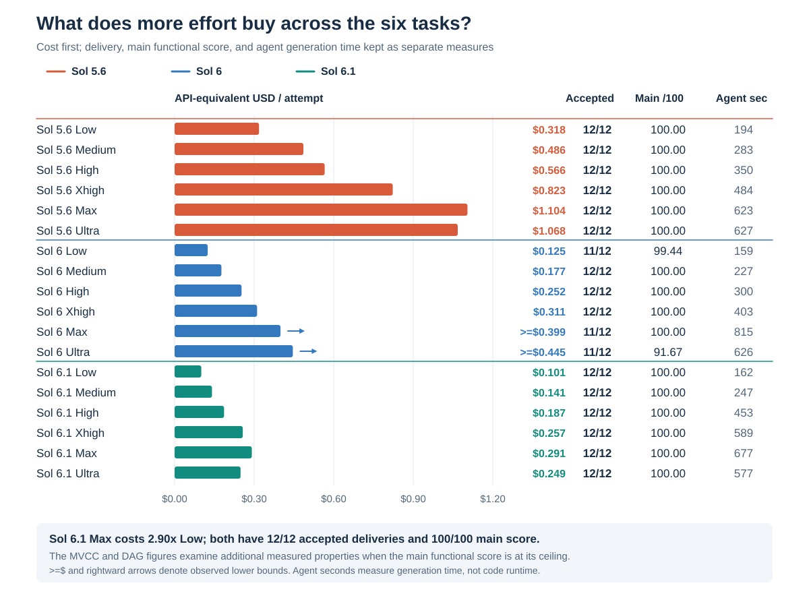
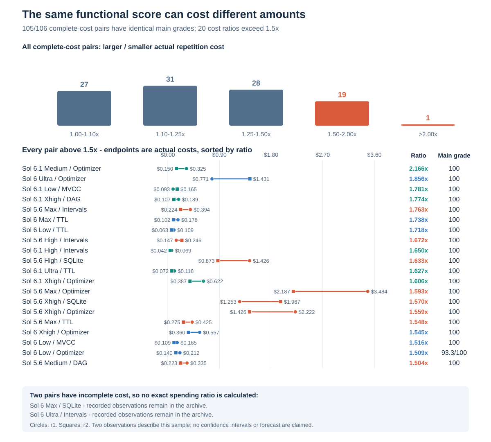
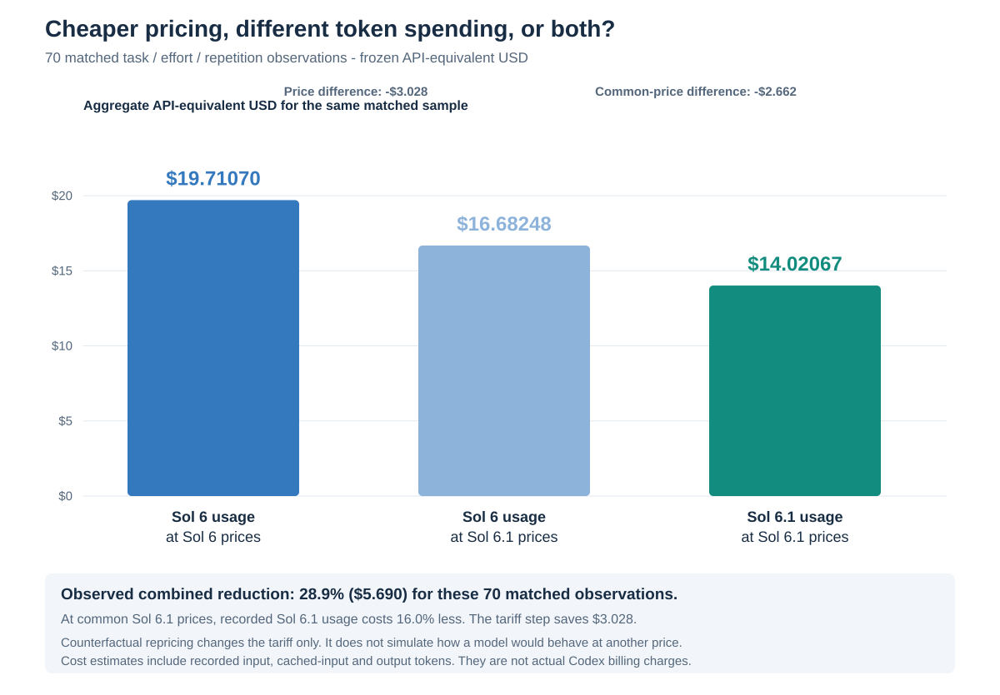

# Six findings from the archived benchmark

The useful differences extend beyond a main-test leaderboard. Sixteen of eighteen settings reached a 100/100 main functional score, and 213 of 216 attempts were accepted deliveries. The findings below examine **candidate-written tests, generated-code performance, effort spending, repetition spread and token pricing**. Each has its own denominator and scope; none is an overall intelligence or code-quality ranking.

All dollar amounts are frozen Standard **API-equivalent token estimates**, not billed money. These analyses derive from the existing archive, without new model calls or changes to grades. [All configurations](results.md), [scoring](scoring.md), [methodology](methodology.md) and [limitations](limitations.md) provide the wider context. The machine-readable derivations are in [results/insights.json](../results/insights.json).

## 1. MVCC tests reveal a cost-versus-quality tradeoff

Every archived MVCC implementation passed the main evaluator. Their added tests nevertheless differed in detecting the same six seeded transactional defects.

| Model and effort | Mean MVCC USD / attempt | Defects detected, repetition 1 | Defects detected, repetition 2 |
| --- | ---: | ---: | ---: |
| Sol 5.6 Low | $0.304958 | 0/6 | 0/6 |
| Sol 6 Low | $0.136709 | 3/6 | 0/6 |
| Sol 6.1 Low | $0.128862 | 4/6 | 5/6 |
| Sol 6.1 Medium | $0.141621 | 5/6 | 6/6 |
| Sol 6.1 High | $0.202893 | 6/6 | 6/6 |

Moving from Sol 6.1 Low to Medium increased mean task cost **9.9%** and improved detection from **9/12 to 11/12 defect opportunities across the two attempts**. High is the cheapest setting whose tests detected all six defects in both repetitions. Xhigh, Max and Ultra also achieved 6/6 twice, with different costs. This gives a concrete test-quality comparison where the main behavior checks were tied.

The Y-axis is mutation sensitivity: `100 × detected defects / 6`. Candidate-added tests must pass on the candidate and positive control before a usable sensitivity score is produced. The setting mean requires **2/2 usable repetitions**; Sol 6 Max has only one usable result and therefore no pair mean. No recognized added tests gives zero for this criterion alone; a reference incompatibility, timeout or inconclusive execution is N/A. The score concerns six declared defects, rather than all plausible bugs.

## 2. The defect matrix shows what tests anticipated

A mean hides which behaviors the tests exercised. The matrix retains all 36 MVCC attempts and distinguishes detected defects, missed defects, no recognized added tests and unavailable evidence.

| Seeded defect | Behavior the tests need to expose |
| --- | --- |
| `write_skew` | Read dependencies must participate in serializable validation |
| `no_phantom_check` | Scanned prefixes must detect later writes, including previously empty ranges |
| `read_current_state` | Reads must use the transaction snapshot rather than current committed state |
| `forget_reads_on_rollback` | Rolling back staged writes must retain read and range dependencies |
| `recovery_accepts_gaps` | Recovery must reject gaps in the version sequence |
| `checkpoint_alias` | A checkpoint must copy state rather than expose mutable internal data |

Only executed assertion failures count as detected defects in this complex-task evaluator. Import errors and hangs are inconclusive. A gray unavailable row is therefore different from a usable row that misses every defect. The matrix describes generated test evidence; it does not imply that the candidate implementation contained the seeded defect.

## 3. Higher effort can change the generated code's performance

The DAG task has recorded execution and allocation measurements, so it can connect generation spending to the behavior of the resulting implementation.

For Sol 6.1, moving from Low to Ultra increased task generation cost **2.11×**. Mean recorded DAG execution time fell from about **77.3 to 52.3 ms**, a **32.3% reduction**; peak Python allocation fell from about **781.3 to 704.7 KiB**. Both settings passed the task's main checks. This is evidence of a different output implementation despite identical functional grades.

The fixed workload is a 1,500-node DAG. Each candidate's runtime record is the median of three sequential runs after one warm-up; each setting averages two candidates. Allocation comes from a separate `tracemalloc` run. It is Python allocation, not total process RSS. These are descriptive measurements on the historical machine, not a guarantee that every higher-effort setting is faster or that the improvement transfers to another workload. Equivalent profiles exist for the original four tasks only; there is no six-task runtime or memory leaderboard.

## 4. The effort premium needs an explicit outcome

Spending more can improve a specific criterion while leaving another unchanged. The suite-wide effort comparison retains dollars, main behavior and completed delivery together.

Across all six tasks, Sol 6.1 Low averaged **$0.100586 per attempt** and Max **$0.291200**: **2.895× the cost**. Mean agent time rose from **161.68 to 676.83 seconds**, or **4.186×**. Both settings reached **100/100 main functional score and 12/12 accepted deliveries**. The main checks therefore do not demonstrate an aggregate functional gain from that extra spending, even though the MVCC tests and DAG runtime provide narrower differences.

All twelve attempts contribute to each setting's dollar and time mean. Accepted delivery additionally requires the agent turn to complete; it is not the saved code's grade. The two Sol 6 settings with partial telemetry retain explicit observed lower bounds rather than synthetic zero costs. Connected effort settings do not imply monotonic improvement or an established scaling law.

## 5. Same grade can come with a different dollar cost

Two repetitions cannot estimate long-run reliability, but they can show the observed cost spread for the same task and configuration.

Of **106 repetition pairs with exact costs**, **105 had identical main functional grades**. In **20 pairs**, the more expensive repetition cost **more than 1.5×** the cheaper one. A point estimate can therefore conceal meaningful variation in the observed spending even when the grade repeats.

Each pair uses the same model, effort and task; its ratio is `higher exact cost / lower exact cost`, independent of repetition order. Two pairs are excluded from the exact-cost analysis because one observation has partial telemetry. The figure preserves their missingness separately. These are observed pairs, not confidence intervals, a forecast of the next run, or a claim about variance across all programming work.

## 6. A pricing bridge separates tariff and usage effects

Sol 6 and Sol 6.1 have the same frozen input, cache-write and output rates, but different cached-input rates. The bridge asks how much of their matched cost difference remains after applying the same tariff.

| Bridge step | API-equivalent USD, summed over 70 matched attempts |
| --- | ---: |
| Recorded Sol 6 tokens at frozen Sol 6 rates | $19.7107040 |
| The same Sol 6 tokens repriced at frozen Sol 6.1 rates | $16.6824800 |
| Recorded Sol 6.1 tokens at frozen Sol 6.1 rates | $14.0206652 |

The matched observed cost difference is **28.9%**. Repricing the same Sol 6 usage accounts for a **$3.0282240** reduction; the remaining difference under the common Sol 6.1 tariff is **$2.6618148**, or **16.0% of the repriced Sol 6 total**. Those percentages use different denominators and should not be added.

Matching uses task, effort and repetition. The two keys with partial Sol 6 cost telemetry are excluded **from both models**, leaving 70 matched observations per model. The middle bar changes only the frozen cached-input tariff while retaining Sol 6's request-level usage, including any applicable long-context multipliers. The final step uses the observed Sol 6.1 usage under that same tariff.

This is a descriptive, **order-dependent counterfactual repricing**, not a causal decomposition or proof of intrinsic model efficiency. Starting from Sol 6.1's usage and applying the reverse tariff could allocate the difference differently. It also does not isolate why usage differed: cache behavior, reasoning, commands and generation all contribute. The original per-attempt prices remain unchanged.

## Rebuild and inspect the evidence

[scripts/derive_insights.py](../scripts/derive_insights.py) reconstructs the derived records from the checked-in result exports, while [scripts/analyze_results.py](../scripts/analyze_results.py) regenerates the web tables and figures. The [reproduction guide](reproduction.md) covers these offline operations and the standalone PDF builder. Follow run IDs in [results/insights.json](../results/insights.json) to the original result and candidate records when checking an individual point.
