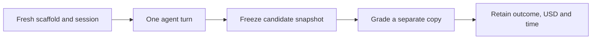

# Methodology

This benchmark primarily compares **API-equivalent USD against tested functional code quality** for three Codex models on six specified Python programming tasks. Elapsed agent time is a secondary measure. It contains **216 attempts**: three models × six reasoning efforts × six tasks × two repetitions. The archived experiment has **214 completed attempts and 213 accepted deliveries**. Every scheduled outcome remains in the archive, including failures.

Start with the [results](results.md), then consult [task design](tasks.md), [scoring](scoring.md), [limitations](limitations.md) and [reproduction](reproduction.md). The [English PDF](../artifacts/Sol_Benchmark_Consolidated_EN.pdf) presents the consolidated charts and analysis.

## Comparison matrix

| Dimension | Fixed values |
| --- | --- |
| Models | `gpt-5.6-sol`, `gpt-6-sol`, `gpt-6.1-sol` |
| Reasoning efforts | `low`, `medium`, `high`, `xhigh`, `max`, `ultra` |
| Tasks | Interval union; TTL/LRU cache; concurrent DAG; reservation service; exact optimizer; MVCC/recovery |
| Repetitions | Two fresh attempts for each model/effort/task combination |
| Speed | Standard |
| Implementation | Python standard library; SQLite and local HTTP where required |
| Historical runtime | Codex CLI 0.159.0, Node.js 22.18.0, Python 3.14.0, Windows, PowerShell 7 |

A model/effort setting has twelve observations: two attempts on each of six tasks. A task has 36 attempts. Model IDs and effort settings describe the recorded experiment; they are not a promise of present availability. The stand checks the native catalog and effective settings before inference, disables provider-model fallback and fails if the requested configuration cannot be verified.

## What one attempt includes

An attempt starts with a fresh copied scaffold, a fresh Codex session and a single user turn containing the task contract. The agent can inspect and change its own workspace, execute commands, run the public tests and add tests. It receives no hidden-test results or second chance after grading. Candidate instructions forbid outside references, other attempts, graders, web access, skills, external services and subagents. The candidate sandbox has network access disabled; local loopback tests are permitted for the reservation service.

Paid attempts run sequentially. The schedule interleaves model/effort combinations and reverses the order within each task for repetition two, reducing a simple fixed-order advantage. There are **no automatic inference retries**. A capacity failure, interruption or timeout is retained rather than replaced by a successful rerun.



SHA-256 manifests bind the prepared contracts, evaluator, controls, configuration and harness. Candidate snapshots are hashed after execution and checked before evaluation. Public tests and instructions are protected files. The recorded prompt hash is identical across all 36 attempts on a given task. [Provenance](provenance.md) explains the distinction between the original measured inputs and this portable repository.

## Dollar accounting

The primary cost measure is **API-equivalent USD for the observed Codex tokens**, using one frozen Standard price schedule. It is a counterfactual estimate, **not an API invoice or a Codex subscription bill**. Prices were frozen on **30 September 2026** and verified on **1 October 2026**. This experiment does not claim that these are current prices.

| Model | Input | Cached input | Cache write | Output |
| --- | ---: | ---: | ---: | ---: |
| Sol 5.6 | $4.00 | $0.40 | $5.00 | $20.00 |
| Sol 6 | $2.00 | $0.20 | $2.50 | $10.00 |
| Sol 6.1 | $2.00 | $0.10 | $2.50 | $10.00 |

All rates are USD per million tokens. For each request, let `I` be total input tokens, `C` cached input tokens, `W` cache-write input tokens and `O` output tokens. The short-context calculation is:

```text
USD = ((I - C - W) × input_rate
       + C × cached_input_rate
       + W × cache_write_rate
       + O × output_rate) / 1,000,000
```

Reasoning tokens are already part of output tokens and are not charged twice. The frozen schedule applies a 2× input/cache multiplier and 1.5× output multiplier when a request has more than 272,000 input tokens. The calculation uses per-request telemetry when available. Hosted-tool charges and regional premiums are excluded. Pricing Ultra runs does not imply that the API exposes an Ultra option.

An exact estimate requires complete usage tied to the completed turn, valid counters, and enough cache-write/request detail to determine the cost. Otherwise the exporter retains bounds on observed usage. For an interrupted attempt, even an upper bound on observed tokens is **not** an upper bound on its unknown complete cost.

The archive contains 214 exact estimates and two partial observations. Its observed subtotal is $87.5980432; the report conservatively displays **at least $87.59**, because a complete experiment total cannot be established. The 72 optimizer/MVCC attempts have exact total API-equivalent cost of $41.8110868.

For a fully observed setting:

- **USD per attempt** is the total cost of all twelve attempts divided by twelve.
- **USD per accepted delivery** is that same total divided by the accepted count. Spending on unsuccessful attempts remains included.
- Missing cost data is disclosed as unavailable or an observed lower bound. It is not removed silently and is never assigned zero.

The primary chart places **API-equivalent USD per attempt on X** and the **six-task main functional macro score out of 100 on Y**. Lower cost is left and higher functional score is up. Each setting includes all twelve recorded attempt grades; a passing timeout snapshot and a provider-failed scaffold retain their recorded grades. Accepted-delivery percentage is shown separately because it also requires a completed turn.

Model colors are consistent; effort points are connected within each model in effort order. A connecting line helps trace settings and does not imply interpolation or a causal relationship. Asterisks and right-pointing arrows identify partial observed-cost lower bounds: the unknown full cost lies to the right. A full 0–100 score view accompanies an explicitly labeled ceiling zoom so that a small score difference is not mistaken for a large quality gain. Time has its own secondary figure.

Token-based credit estimates are secondary telemetry. Account-wide balance changes cannot reliably identify billed credits for an individual attempt, so neither quota percentages nor balance deltas determine the dollar comparisons.

## Time accounting

**Agent elapsed time** starts immediately before submitting `turn/start` and ends at the `turn/completed` event or the terminal failure/timeout. It includes reasoning, generated text, tool execution, self-tests, environment recovery and waits during that turn. Session preparation, post-turn snapshotting and external grading are excluded. This is end-to-end agent latency, not pure model inference time.

The agent limits are 10 minutes for interval union, 20 for the cache and 40 for each other task. Hidden grading has a separate 90-second process limit. Each optimizer scale fixture has its own isolated 8-second limit. These limits assess different activities and should not be conflated.

Generated-code runtime is a separate measure for the original four tasks: one warm-up, the median of three sequential workload runs, and a separate Python allocation measurement with `tracemalloc`. Those measurements do not include generation time and do not measure total process RSS, native allocations or SQLite memory. Equivalent profiles were not collected for the optimizer and MVCC tasks.

## Quality and aggregation

The main chart uses functional behavior as a measurable quality criterion. Completed delivery, expanded correctness, candidate-test sensitivity and generated-code performance remain separate measures; pending manual review prevents a complete overall code-quality score. A candidate snapshot can pass all functional checks even if its agent turn did not finish; that does not make it an accepted delivery. [Scoring](scoring.md) specifies the exact rules.

Within each model/effort/task cell, average the two task scores. Then average the six task means equally. Each task contributes one sixth, regardless of how many tests it contains. Do not pool all test methods into a single overall pass rate. The complete main functional aggregate requires both repetitions for all six tasks; incomplete coverage is unavailable. This is the existing recorded macro score, not a new weighting or a post-hoc composite.

The near-perfect functional results leave limited separation among most settings. Two repetitions support descriptive comparisons and visible spread, not a reliable estimate of rare failures or a general ranking of intelligence. See [limitations](limitations.md) before using the results in a broader claim.

## Protocol and price references

The recorded implementation uses the [Codex app-server protocol](https://learn.chatgpt.com/docs/app-server) and [Codex CLI](https://learn.chatgpt.com/docs/codex/cli). The frozen configuration records the historical model-price sources; the [API pricing documentation](https://developers.openai.com/api/docs/pricing) is the place to verify a new price schedule before a new experiment. Changing prices should produce a separately labeled repricing analysis rather than rewriting the archived estimates.
