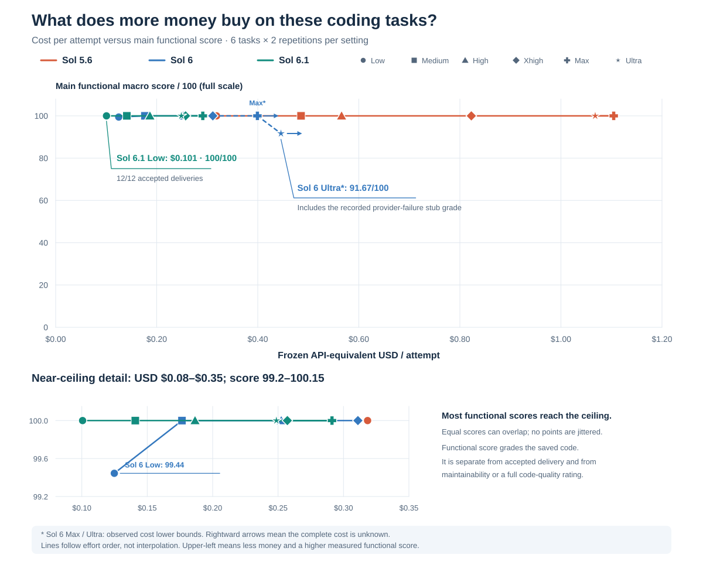
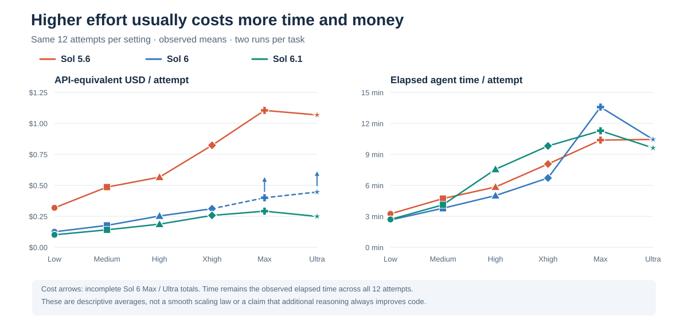
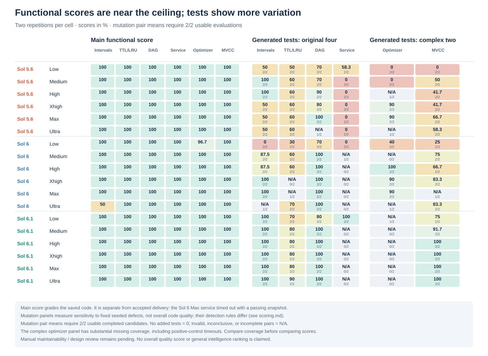
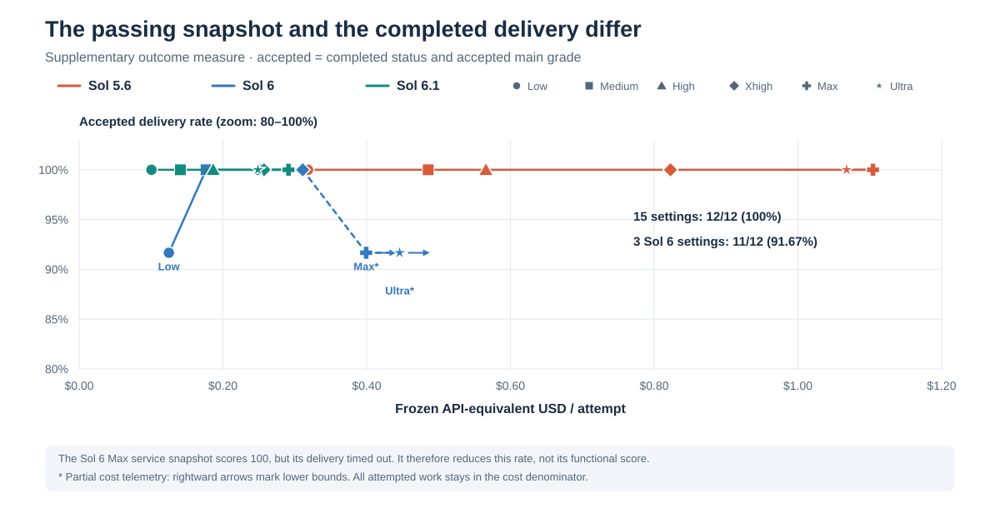
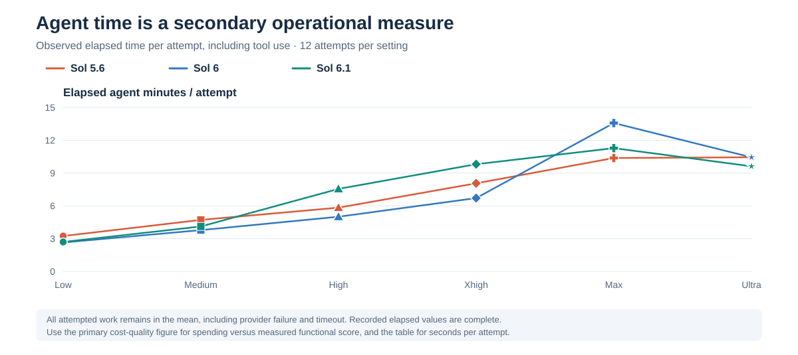

# Results reference

For the six main stories and their new figures, start with [Findings: what the benchmark reveals](findings.md). The leading case compares MVCC task cost with the ability of generated tests to detect six fixed defects. This page retains the full functional, delivery, cost and supplementary evidence tables.

**Sol 6.1 Low reaches a 100/100 main functional score at the lowest observed exact cost:** $0.101 API-equivalent USD per attempt, averaged over all six tasks and both repetitions. It also has 12/12 accepted deliveries. Most settings reach the functional-score ceiling; spending more does not separate them on these checks.

The archive contains **216 attempts**, **214 completed deliveries**, and **213 accepted deliveries**. A delivery counts as accepted only when its status is `completed` **and** its main grade is accepted. All attempts, including failures, remain in the cost and time denominators. See the [methodology](methodology.md), [scoring rules](scoring.md), and [task catalogue](tasks.md).

## Supplementary functional-score view



This supplementary chart puts **frozen API-equivalent USD per attempt on X** and the **six-task main functional macro score out of 100 on Y**. Sixteen of eighteen settings score 100, so this view provides functional context rather than the main comparison. Each task contributes equally: its score is the mean of its two saved-code grades, then the six task means are averaged. This is a specific functional-quality measure, not a completed manual review or an overall code-quality composite. The plot keeps recorded grades for all attempts, including the provider-failure stub and the passing timeout snapshot.

Cost is a counterfactual calculation from observed tokens at the **frozen 30 September 2026 Standard API rates** in [results.json](../results/results.json). It is not a Codex subscription invoice or a measurement of purchased credits.

Each setting has **12 attempts**: six tasks × two repetitions. Colors identify models and markers identify effort. The connected points follow Low → Medium → High → Xhigh → Max → Ultra within each model; they do not imply interpolation or a monotonic scaling law. **Rightward arrows**, asterisks, and dashed segments mark the two settings with incomplete cost telemetry. The full 0–100 overview has headroom; the labeled near-ceiling detail uses a smaller range. Equal measured scores can overlap, and no point is jittered.



### All 18 settings

`USD / accepted` divides the cost of **all attempted work** by the number of accepted deliveries. Main functional score is the macro mean of the six task scores, each averaged over two snapshots; it is a different measure from accepted delivery.

| Model | Effort | USD / attempt | Main functional score % | Accepted | USD / accepted | Agent seconds / attempt |
|---|---|---:|---:|---:|---:|---:|
| Sol 5.6 | Low | $0.318 | 100.00 | 12/12 | $0.318 | 194.2 |
| Sol 5.6 | Medium | $0.486 | 100.00 | 12/12 | $0.486 | 282.8 |
| Sol 5.6 | High | $0.566 | 100.00 | 12/12 | $0.566 | 350.1 |
| Sol 5.6 | Xhigh | $0.823 | 100.00 | 12/12 | $0.823 | 483.7 |
| Sol 5.6 | Max | $1.104 | 100.00 | 12/12 | $1.104 | 622.6 |
| Sol 5.6 | Ultra | $1.068 | 100.00 | 12/12 | $1.068 | 626.8 |
| Sol 6 | Low | $0.125 | 99.44 | 11/12 | $0.136 | 158.7 |
| Sol 6 | Medium | $0.177 | 100.00 | 12/12 | $0.177 | 226.7 |
| Sol 6 | High | $0.252 | 100.00 | 12/12 | $0.252 | 300.2 |
| Sol 6 | Xhigh | $0.311 | 100.00 | 12/12 | $0.311 | 402.6 |
| Sol 6 | Max | ≥$0.399 | 100.00 | 11/12 | ≥$0.435 | 814.6 |
| Sol 6 | Ultra | ≥$0.445 | 91.67 | 11/12 | ≥$0.486 | 626.4 |
| Sol 6.1 | Low | $0.101 | 100.00 | 12/12 | $0.101 | 161.7 |
| Sol 6.1 | Medium | $0.141 | 100.00 | 12/12 | $0.141 | 246.7 |
| Sol 6.1 | High | $0.187 | 100.00 | 12/12 | $0.187 | 453.1 |
| Sol 6.1 | Xhigh | $0.257 | 100.00 | 12/12 | $0.257 | 588.6 |
| Sol 6.1 | Max | $0.291 | 100.00 | 12/12 | $0.291 | 676.8 |
| Sol 6.1 | Ultra | $0.249 | 100.00 | 12/12 | $0.249 | 577.1 |

`≥` indicates a conservative observed cost lower bound, rounded down. The complete cost of Sol 6 Max and Ultra is unknown because one attempt in each setting has partial token telemetry. The observed API-equivalent subtotal for the whole archive is **$87.5980432**; it is not a complete final total. Exact cost estimates are available for **214/216** attempts. The two complex tasks contribute **$41.8110868**, all with complete cost telemetry.

## What the quality evidence shows



The main checks are close to a ceiling: 15 of 18 settings achieved 12/12 accepted deliveries. Increasing effort adds substantial cost and time without separating most settings on these checks. Two repetitions per task are too few to estimate rare failures reliably, and six tasks cannot establish a general intelligence ranking. The reported means are descriptive; no confidence intervals or significance claims are inferred from this small sample.

### Accepted delivery is a separate outcome



This supplementary chart uses `accepted / 12 × 100` on Y and explicitly zooms its scale to 80–100% with headroom. A passing saved-code snapshot alone does not imply successful delivery: the Sol 6 Max service snapshot scored 100, but the attempt timed out and was not accepted. Sol 6 Low, Max, and Ultra each have 11/12 accepted deliveries; the other 15 settings have 12/12. These rates are the outcomes of this small sample, not estimated long-run success probabilities.

### Agent time is secondary



Elapsed time is wall-clock agent time, including tool use and unsuccessful deliveries; it is separate from the generated code's execution speed. Sol 6.1 Low averaged 161.7 seconds per attempt. Sol 6 Low was slightly faster (158.7 seconds) but one optimizer attempt missed a scale requirement. All attempts remain in the time mean, including the recorded 40-minute timeout.

The complex tasks make algorithmic and state reasoning explicit. The optimizer combines signed values, dependencies, asymmetric conflicts, multiple resource constraints, mandatory projects, and exact tie-breaking. The MVCC task checks snapshots, conservative serializability, savepoints retaining reads, phantom detection, ABA, write skew, and checkpoint/replay. All small exhaustive optimizer oracle checks and all MVCC main checks passed. The optimizer's scale test produced the one new functional failure.

Generated tests provide an additional, narrower signal: **Sol 6.1's MVCC tests detected all six fixed seeded defects in both repetitions at High, Xhigh, Max, and Ultra.** This measures test sensitivity for that task and defect set; it does not establish an overall quality or intelligence winner.

### Generated-test sensitivity and coverage

The table shows a pair mean **only when both repetitions are usable**, with usable coverage out of two. A partially covered pair shows N/A and its actual coverage (for example, `N/A (1/2)`). Only completed candidates enter this table. **N/A is missing evidence, not zero.** A zero score for no recognized added tests concerns this criterion alone. Scores on the original four tasks and the complex two use different frozen detection rules and defect sets; do not average the six columns into an overall quality number.

| Model / effort | Intervals | TTL/LRU | DAG | Service | Optimizer | MVCC |
|---|---:|---:|---:|---:|---:|---:|
| Sol 5.6 Low | 50.0% (2/2) | 50.0% (2/2) | 70.0% (2/2) | 58.3% (2/2) | 0.0% (2/2) | 0.0% (2/2) |
| Sol 5.6 Medium | 100.0% (2/2) | 60.0% (2/2) | 70.0% (2/2) | 0.0% (2/2) | 0.0% (2/2) | 50.0% (2/2) |
| Sol 5.6 High | 100.0% (2/2) | 60.0% (2/2) | 90.0% (2/2) | 0.0% (2/2) | N/A (1/2) | 41.7% (2/2) |
| Sol 5.6 Xhigh | 50.0% (2/2) | 60.0% (2/2) | 80.0% (2/2) | 0.0% (2/2) | 90.0% (2/2) | 41.7% (2/2) |
| Sol 5.6 Max | 50.0% (2/2) | 60.0% (2/2) | 100.0% (2/2) | 0.0% (2/2) | 90.0% (2/2) | 66.7% (2/2) |
| Sol 5.6 Ultra | 50.0% (2/2) | 60.0% (2/2) | N/A (1/2) | 0.0% (2/2) | N/A (1/2) | 58.3% (2/2) |
| Sol 6 Low | 0.0% (2/2) | 30.0% (2/2) | 70.0% (2/2) | 0.0% (2/2) | 40.0% (2/2) | 25.0% (2/2) |
| Sol 6 Medium | 87.5% (2/2) | 60.0% (2/2) | 100.0% (2/2) | N/A (1/2) | N/A (0/2) | 75.0% (2/2) |
| Sol 6 High | 87.5% (2/2) | 60.0% (2/2) | 100.0% (2/2) | N/A (0/2) | 100.0% (2/2) | 66.7% (2/2) |
| Sol 6 Xhigh | 100.0% (2/2) | N/A (0/2) | 100.0% (2/2) | N/A (0/2) | 90.0% (2/2) | 83.3% (2/2) |
| Sol 6 Max | 100.0% (2/2) | N/A (1/2) | 100.0% (2/2) | N/A (0/2) | 90.0% (2/2) | N/A (1/2) |
| Sol 6 Ultra | N/A (1/2) | 70.0% (2/2) | 100.0% (2/2) | N/A (0/2) | N/A (1/2) | 83.3% (2/2) |
| Sol 6.1 Low | 100.0% (2/2) | 70.0% (2/2) | 80.0% (2/2) | 100.0% (2/2) | N/A (1/2) | 75.0% (2/2) |
| Sol 6.1 Medium | 100.0% (2/2) | 80.0% (2/2) | 100.0% (2/2) | N/A (0/2) | N/A (0/2) | 91.7% (2/2) |
| Sol 6.1 High | 100.0% (2/2) | 80.0% (2/2) | 100.0% (2/2) | N/A (0/2) | N/A (0/2) | 100.0% (2/2) |
| Sol 6.1 Xhigh | 100.0% (2/2) | 80.0% (2/2) | 100.0% (2/2) | N/A (0/2) | N/A (0/2) | 100.0% (2/2) |
| Sol 6.1 Max | 100.0% (2/2) | 80.0% (2/2) | 100.0% (2/2) | N/A (0/2) | N/A (0/2) | 100.0% (2/2) |
| Sol 6.1 Ultra | 100.0% (2/2) | 90.0% (2/2) | 100.0% (2/2) | N/A (0/2) | N/A (0/2) | 100.0% (2/2) |

Usable generated-test evidence is available for **175/214 completed candidates**, including **29** with no recognized additional test files. For the complex tasks, **55/72** scores are usable (including ten zero scores for no recognized added tests); **17** are unavailable. Of the 16 unavailable optimizer evaluations, 12 positive-control reference runs exceeded the 30-second limit, three had import/execution problems, and one mutant result was inconclusive. The remaining unavailable evaluation is Sol 6 Max MVCC repetition 2, whose tests failed the positive reference. These evaluator limitations do not prove a candidate implementation defect.

For the original four tasks, additional boundary/property checks passed **920/922 checks** across completed candidates. The two failures concern huge integer TTL values. Code runtime and peak Python allocation evidence in [quality-v2.1.json](../results/quality-v2.1.json) covers those original four tasks only. Manual maintainability, design, and broader code review remain pending; the archive does not support a completed overall code-quality score.

## Failures and diagnostic evidence

| Attempt | Outcome | Evidence and interpretation |
|---|---|---|
| [Sol 6 Low optimizer r1](../candidates/05-optimizer-6-sol-low-r1/) | Completed; rejected | `Planner.test_scale_positive_bound` exceeded the eight-second limit. Small exact-answer cases passed. |
| [Sol 6 Ultra intervals r1](../candidates/01-easy-6-sol-ultra-r1/) | Provider failure | The provider reported capacity failure; the saved stub scored zero. Cost telemetry is partial. |
| [Sol 6 Max service r2](../candidates/04-components-6-sol-max-r2/) | 40-minute timeout | The saved code passed main and expanded checks, but the delivery did not complete. Cost telemetry is partial. |
| [Sol 5.6 Low cache r2](../candidates/02-medium-5.6-sol-low-r2/) | Expanded-check defect | Main checks passed. A valid huge integer TTL with an integer clock raises `OverflowError` through `math.isfinite`. |
| [Sol 6 Low cache r1](../candidates/02-medium-6-sol-low-r1/) | Expanded-check defect | The same huge integer TTL boundary defect was exposed by the expanded suite. |

The [bounded optimizer replay](../results/scale-diagnostic.json) reproduced the Sol 6 Low r1 timeout (8.012 seconds). The reference completed in 0.196 seconds and paired r2 in 0.223 seconds. This replay used saved code, made no model calls, and **did not replace the original grades or benchmark timings**. The fixture has 31 affordable positive projects and one huge-value, individually unaffordable decoy, exposing the importance of a useful pruning bound.

## Explore and reproduce

- [Canonical results and per-attempt token/cost/grade records](../results/results.json)
- [Original-task expanded quality evidence](../results/quality-v2.1.json)
- [Complex-task generated-test evidence](../results/complex-test-strength.json)
- [Immutable candidate snapshots](../candidates/)
- [Frozen experiment provenance](../results/provenance.json)
- [Archive manifest](../results/archive-manifest.json)
- [Consolidated English PDF](../artifacts/Sol_Benchmark_Consolidated_EN.pdf)

Regenerate this page and the SVG charts from the archived data without network access or model calls:

```sh
python scripts/analyze_results.py
```

PNG previews are optional:

```sh
python -m pip install -r requirements-report.txt
python scripts/analyze_results.py --png
```

The script asserts 216 unique attempts, the full model/effort/task/repetition matrix, 12 attempts per setting, acceptance status, functional macro scores, observed mean times, and cost telemetry coverage before writing derived outputs. It reads the frozen archive and regenerates this page, `results/insights.json`, six insight chart families and five supplementary chart families under `assets/`. It does not rerun inference, modify saved candidates, change grades, or regenerate the PDF. The six insight figures cover MVCC test value, its defect matrix, DAG code efficiency, effort value, repetition costs and the pricing counterfactual. SVG outputs are deterministic and do not depend on third-party packages; PNG rasterization uses local fonts and can vary slightly across platforms.
